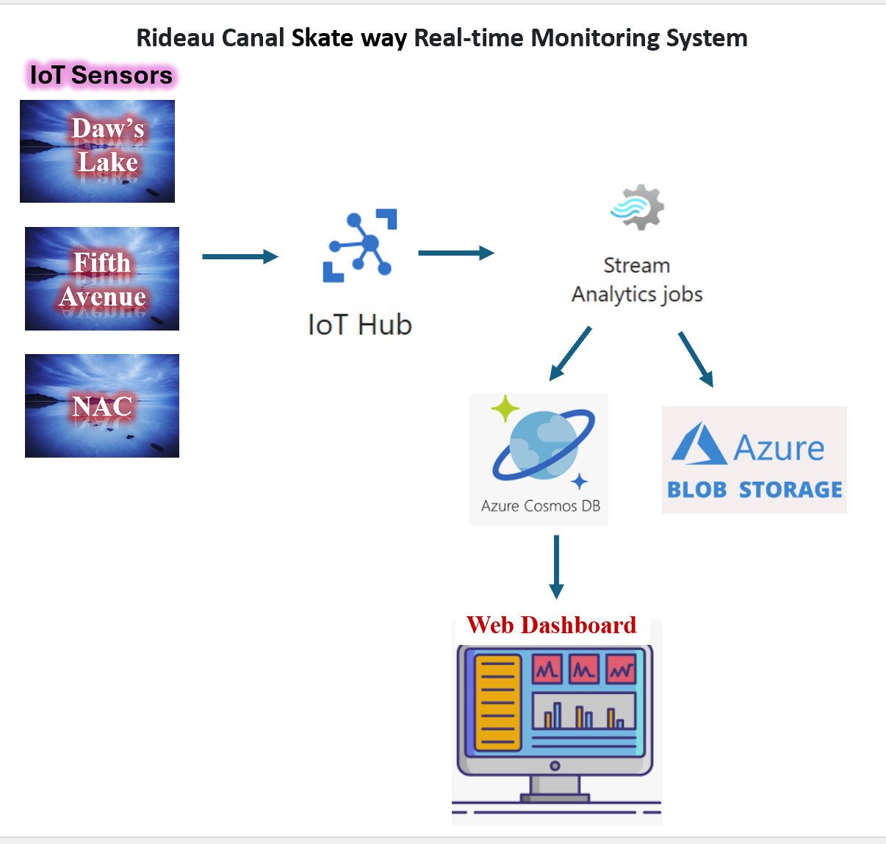
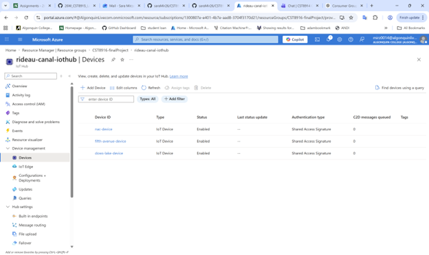
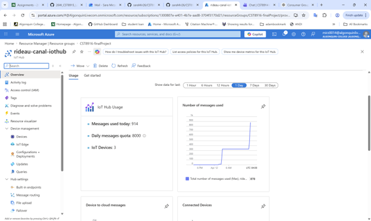
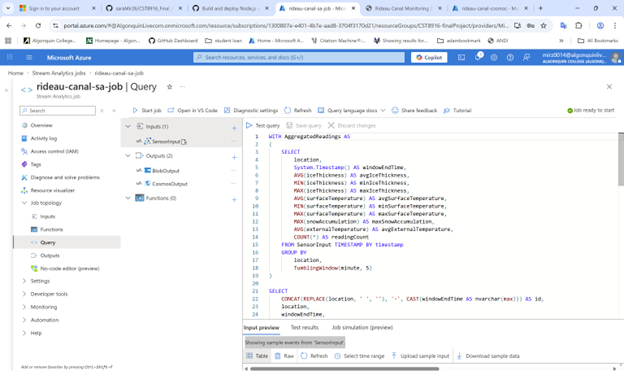
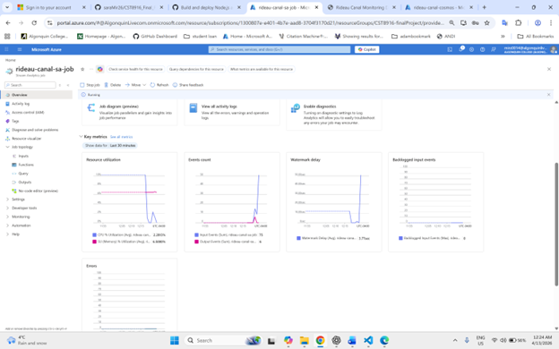
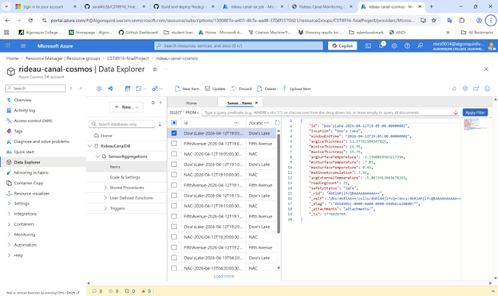
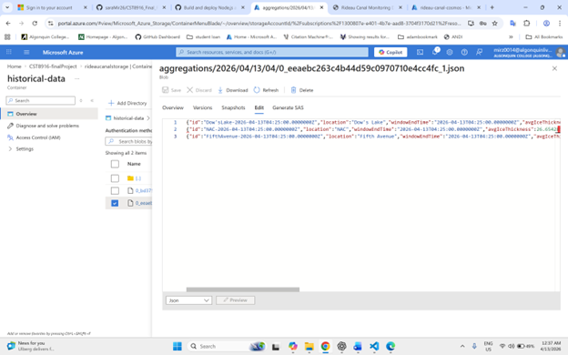
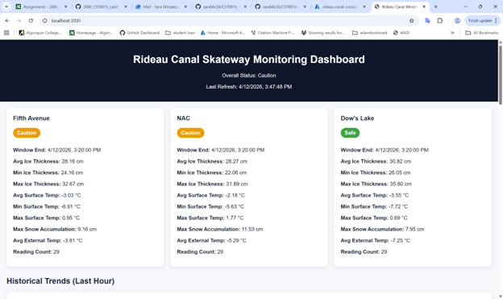
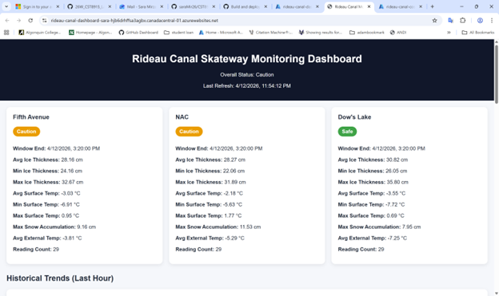

# Rideau Canal Skateway Real-time Monitoring System

## Student Information
- **Name:** Sara Mirzaei
- **Student ID:** 040467655
- **Course:** CST8916 - Remote Data and Real-time Applications

---

## Project Overview

This project implements a real-time monitoring system for the Rideau Canal Skateway in Ottawa. The system simulates IoT sensors at multiple locations to monitor ice conditions and environmental factors, ensuring skater safety.

The system collects, processes, stores, and visualizes real-time data using Microsoft Azure services.

---

## Scenario Overview

The Rideau Canal Skateway requires continuous monitoring of:

- Ice thickness
- Surface temperature
- Snow accumulation
- External temperature

The goal is to provide real-time safety insights using a cloud-based streaming architecture.

---

## System Architecture

### Data Flow

1. Simulated IoT sensors generate data every 10 seconds
2. Data is sent to Azure IoT Hub
3. Azure Stream Analytics processes data in 5-minute windows
4. Processed data is:
   - Stored in Azure Cosmos DB
   - Archived in Azure Blob Storage
5. The Web Dashboard retrieves and displays real-time data

---

## Azure Services Used

- Azure IoT Hub
- Azure Stream Analytics
- Azure Cosmos DB
- Azure Blob Storage
- Azure App Service

---

## Implementation Overview

### IoT Sensor Simulation
- Simulates 3 locations:
  - Dow's Lake
  - Fifth Avenue
  - NAC
- Sends JSON data every 10 seconds
- Implemented in Python

 Check  [Simulation Repository](https://github.com/saraMir26/CST8916-Finalproject-rideau-canal-sensor-simulation) 

---

### Azure IoT Hub
- Receives data from simulated devices
- Manages device connections

---

### Stream Analytics Job

Uses a 5-minute tumbling window to calculate:

- Average ice thickness
- Min/max ice thickness
- Average surface temperature
- Min/max surface temperature
- Max snow accumulation
- Average external temperature
- Reading count

### Safety Logic

- **Safe:** Ice ≥ 30cm AND Surface Temp ≤ -2°C
- **Caution:** Ice ≥ 25cm AND Surface Temp ≤ 0°C
- **Unsafe:** Otherwise

---

### Cosmos DB

- Database: RideauCanalDB
- Container: SensorAggregations
- Stores processed real-time data

---

### Blob Storage

- Container: historical-data
- Stores archived JSON files

---

### Web Dashboard

- Built with Node.js and Express
- Displays:
  - Real-time data
  - Safety status
  - Historical charts (last hour)
  - Auto-refresh every 30 seconds

 Check [Dashboard Repository](https://github.com/saraMir26/CST8916-FinalProject-rideau-canal-dashboard)

---

## Video Demonstration

- Video Demo: [YouTube Link](https://youtu.be/rsv1fcyqJlE)

---

## Setup Instructions

### Prerequisites
- Azure account
- Node.js
- Python

### High-Level Steps

1. Deploy Azure resources
2. Run sensor simulator
3. Start Stream Analytics job
4. Run dashboard locally or deploy to Azure

---

## Results and Analysis

### System Output

- Real-time data successfully processed every 5 minutes
- Safety status calculated accurately
- Dashboard updates automatically

### Screenshots

#### IoT Hub Devices

#### IoT Hub Metrics

#### Stream Analytics Query

#### Stream Analytics Running

#### Cosmos DB Data

#### Blob Storage Files

#### Dashboard Local

#### Dashboard Azure

---

## Challenges and Solutions

### Challenge 1
Configuring Stream Analytics outputs correctly.

**Solution:** Verified output aliases and matched them with the query.

### Challenge 2
Handling deployment issues in Azure App Service.

**Solution:** Fixed npm test script and environment variables.

---

## AI Tools Used

- **Tool:** ChatGPT
- **Purpose:** Code generation, debugging, documentation
- **Extent:** Used as guidance and modified all outputs to match project requirements

---

## References

- Azure Documentation
- Node.js Documentation
- Chart.js Documentation
